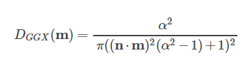

https://www.shadertoy.com/view/MsXBzl

# Raymarching Setup
```c
#define Epsilon         0.001
#define NearClip        Epsilon
#define FarClip         20.0

#define PI              3.14159
#define ONE_OVER_PI     0.31831
#define ONE_OVER_TWO_PI 0.15915

float Roughness         = 0.0;
float Metallic          = 0.0;
float DirectIntensity   = 1.0; // analytic lighting
float AmbientIntensity  = 1.0; // IBL

float RoughTextureOn    = 1.0;
float AlbedoTextureOn   = 1.0;
float IBLSteps          = 1.0;

//------------------------------------------------------------------------------------------
// Math Functions
//------------------------------------------------------------------------------------------

// if(a > b) { return ra; } else { return rb; }
float StepValue1(float a, float b, float ra, float rb){
    float s = step(a, b);
    return (ra * abs(s - 1.0)) + (rb * s);
}

vec3 StepValue3(float a, float b, vec3 ra, vec3 rb){
    float s = step(a, b);
    return (ra * abs(s - 1.0)) + (rb * s);
}

//------------------------------------------------------------------------------------------
// Ray Structures and Functions
//------------------------------------------------------------------------------------------

struct Ray{
	vec3 origin;
    vec3 direction;
};

struct RayHit{
    bool  hit; //if hit?
  	vec3  surfPos;
    vec3  surfNorm;
    float material;
};

//------------------------------------------------------------------------------------------
// Camera Structures and Functions
//------------------------------------------------------------------------------------------

struct Camera{
    vec3 right;
    vec3 up;
    vec3 forward;
    vec3 origin;
};

Ray Camera_GetRay(in Camera camera, vec2 uv){
    Ray ray;

    uv    = (uv * 2.0) - 1.0;
    uv.x *= (iResolution.x / iResolution.y);

    ray.origin    = camera.origin;
    ray.direction = normalize(
      (uv.x * camera.right)
    + (uv.y * camera.up)
    + (camera.forward * 2.5));

    return ray;
}

Camera Camera_LookAt(vec3 origin, vec3 lookAt){
	Camera camera;

    camera.origin  = origin;
    camera.forward = normalize(lookAt - camera.origin);
    camera.right   = normalize(cross(camera.forward, vec3(0.0, 1.0, 0.0)));
    camera.up      = normalize(cross(camera.right, camera.forward));

    return camera;
}

//------------------------------------------------------------------------------------------
// SDF Functions
//------------------------------------------------------------------------------------------

float Scene_SDF(vec3 point, inout RayHit hit){
  	float sdf = FarClip;

    float circle = length(abs(point - vec3(0.0, 0.0, 0.0))) - 1.0;
    hit.material = StepValue1(sdf, circle, 1.0, hit.material);
    sdf = min(sdf, circle);

    return circle;
}

vec3 Scene_Normal(vec3 point){
    RayHit hit;

	return normalize(vec3(
        (Scene_SDF(vec3(point.x + Epsilon, point.y, point.z), hit) -
         Scene_SDF(vec3(point.x - Epsilon, point.y, point.z), hit)),
        (Scene_SDF(vec3(point.x, point.y + Epsilon, point.z), hit) -
         Scene_SDF(vec3(point.x, point.y - Epsilon, point.z), hit)),
        (Scene_SDF(vec3(point.x, point.y, point.z + Epsilon), hit) -
         Scene_SDF(vec3(point.x, point.y, point.z - Epsilon), hit))));
}

//------------------------------------------------------------------------------------------
// Raymarching
//------------------------------------------------------------------------------------------

RayHit RaymarchScene(in Ray ray){
    RayHit hit;

    hit.hit      = false;
    hit.material = 0.0;

    float sdf = FarClip;

    for(float depth = NearClip; depth < FarClip; )
    {
    	vec3 pos = ray.origin + (ray.direction * depth);

        sdf = Scene_SDF(pos, hit);

        if(sdf < Epsilon)
        {
            hit.hit      = true;
            hit.surfPos  = pos;
            hit.surfNorm = Scene_Normal(pos);

            return hit;
        }

        depth += sdf;
    }

    return hit;
}
```

# Light Structures and Functions
## Diffuse BRDF
```c
/**
 * Standard Lambertian diffuse lighting.
 */
vec3 CalculateDiffuse(
    in vec3 albedo){                              
    return (albedo * ONE_OVER_PI);
}
```

## Microfacet Specular BRDF
```c
//------------------------------------------------------------------------------------------
// Light Structures and Functions
//------------------------------------------------------------------------------------------

/**
 * Calculates the vector (h) half-way inbetween the light (l) and view (v).
 *
 *       v\   |h  /l
 *         \  |  /
 *          \ | /
 *           \|/
 * -------------------------
 */
vec3 CalculateHalfVector(
    in vec3 toLight,
    in vec3 toView)
{
    return normalize(toLight + toView);
}
```
### Specular D -  Normal distribution function (NDF)
#### GGX/Trowbridge-Reitz NDF



<iframe src="https://www.desmos.com/calculator/8otf8w37ke?embed" width="360px" height="360px" frameborder="0" style="border: 1px solid #ccc; display:block; margin:auto;"></iframe>
<br>

```c
/**
 * GGX/Trowbridge-Reitz NDF
 *
 * Calculates the specular highlighting from surface roughness.
 *
 * Roughness lies on the range [0.0, 1.0], with lower values
 * producing a smoother, "glossier", surface. Higher values
 * produce a rougher surface with the specular lighting distributed
 * over a larger surface area.
 *
 * See it graphed at:
 * https://www.desmos.com/calculator/pjzk3yafzs
 */
float CalculateNDF(
    in vec3  surfNorm,
    in vec3  halfVector,
    in float roughness)
{
    float a2 = (roughness * roughness);
    float halfAngle = dot(surfNorm, halfVector);

    return (a2 / (PI * pow((pow(halfAngle, 2.0) * (a2 - 1.0) + 1.0), 2.0)));
}
```

### Specular G - Microfacet geometric attenuation
#### GGX/Schlick-Beckmann
```c
/**
 * GGX/Schlick-Beckmann microfacet geometric attenuation.
 *
 * The attenuation is modified by the roughness (input as k)
 * and approximates the influence/amount of microfacets in the surface.
 * A microfacet is a sub-pixel structure that affects light
 * reflection/occlusion.
 */
float CalculateAttenuation(
    in vec3  surfNorm,
    in vec3  vector,
    in float k)
{
    float d = max(dot(surfNorm, vector), 0.0);
 	return (d / ((d * (1.0 - k)) + k));
}
```
#### Smith's method with GGX/Schlick-Beckmann
##### 1. For analytical light
```c
/**
 * GGX/Schlick-Beckmann attenuation for analytical light sources.
 */
float CalculateAttenuationAnalytical(
    in vec3  surfNorm,
    in vec3  toLight,
    in vec3  toView,
    in float roughness)
{
    float k = pow((roughness + 1.0), 2.0) * 0.125;

    // G(l) and G(v)
    float lightAtten = CalculateAttenuation(surfNorm, toLight, k);
    float viewAtten  = CalculateAttenuation(surfNorm, toView, k);

    // Smith
    return (lightAtten * viewAtten);
}
```
##### 2. For IBL
```c
/**
 * GGX/Schlick-Beckmann attenuation for IBL light sources.
 * Uses Disney modification of k to reduce hotness.
 */
float CalculateAttenuationIBL(
    in float roughness,
    in float normDotLight,          // Clamped to [0.0, 1.0]
    in float normDotView)           // Clamped to [0.0, 1.0]
{
    float k = pow(roughness, 2.0) * 0.5;

    // G(l) and G(v)
    float lightAtten = (normDotLight / ((normDotLight * (1.0 - k)) + k));
    float viewAtten  = (normDotView / ((normDotView * (1.0 - k)) + k));

    // Smith
    return (lightAtten * viewAtten);
}
```

### Specular F - Fresnel reflectivity
#### Schlick’s approximation
```c
/**
 * Calculates the Fresnel reflectivity.
 * The metalic parameter controls the fresnel incident value (fresnel0).
 */
vec3 CalculateFresnel(
    in vec3 surfNorm,
    in vec3 toView,
    in vec3 fresnel0)
{
	float d = max(dot(surfNorm, toView), 0.0);
    float p = ((-5.55473 * d) - 6.98316) * d;

    //return fresnel0 + ((1.0 - fresnel0) * pow(1.0 - d, 5.0));
    return fresnel0 + ((1.0 - fresnel0) * pow(2.0, p));
}
```


# Solve Rendering Integral
Diffuse Term + Specular Term
## Specular Term
### 1. For analytical light sources
Cook-Torrance BRDF
```c
/**
 * Cook-Torrance BRDF for analytical light sources.
 */
vec3 CalculateSpecularAnalytical(
    in    vec3  surfNorm,            // Surface normal
    in    vec3  toLight,             // Normalized vector pointing to light source
    in    vec3  toView,              // Normalized vector point to the view/camera
    in    vec3  fresnel0,            // Fresnel incidence value
    inout vec3  sfresnel,            // Final fresnel value used a kS
    in    float roughness)           // Roughness parameter (microfacet contribution)
{
    vec3 halfVector = CalculateHalfVector(toLight, toView);

    float ndf      = CalculateNDF(surfNorm, halfVector, roughness);
    float geoAtten = CalculateAttenuationAnalytical(surfNorm, toLight, toView, roughness);

    sfresnel = CalculateFresnel(surfNorm, toView, fresnel0);

    vec3  numerator   = (sfresnel * ndf * geoAtten); // FDG
    float denominator = 4.0 * dot(surfNorm, toLight) * dot(surfNorm, toView);

#ifdef SPECULAR_NDF_ONLY
    return vec3(ndf);
#elif defined(SPECULAR_ATTEN_ONLY)
    return vec3(geoAtten);
#elif defined(SPECULAR_FRESNEL_ONLY)
    return sfresnel;
#else
    return (numerator / denominator);
#endif
}
```

### 2. For IBL
Importance Sampling + Monte Carlo
```c
/**
 * Generates a 2D directional vector on the hemisphere from the Hammersley point set.
 * Source: http://holger.dammertz.org/stuff/notes_HammersleyOnHemisphere.html
 */
vec2 Hammersley(float i, float numSamples)
{   
    uint bits = uint(i);

    bits = (bits << 16u) | (bits >> 16u);
    bits = ((bits & 0x55555555u) << 1u) | ((bits & 0xAAAAAAAAu) >> 1u);
    bits = ((bits & 0x33333333u) << 2u) | ((bits & 0xCCCCCCCCu) >> 2u);
    bits = ((bits & 0x0F0F0F0Fu) << 4u) | ((bits & 0xF0F0F0F0u) >> 4u);
    bits = ((bits & 0x00FF00FFu) << 8u) | ((bits & 0xFF00FF00u) >> 8u);

    float radicalInverseVDC = float(bits) * 2.3283064365386963e-10; // / 0x100000000

    return vec2((i / numSamples), radicalInverseVDC);
}

/**
 * Importance Sampling to solve the radiance integral.
 *
 * We use importance sampling (as opposed to uniform or random (Monte Carlo)) to
 * generate light sample vectors that are biased to the microsurface halfway
 * vector based on the roughness.
 */
vec3 ImportanceSample(
    in vec2  xi,
    in float roughness,
    in vec3  surfNorm)
{
	float a = (roughness * roughness);

    // Spherical Coordinates to Cartesian
    float phi = 2.0 * PI * xi.x;
    float cosTheta = sqrt((1.0 - xi.y) / (1.0 + (a * a - 1.0) * xi.y));
    float sinTheta = sqrt(1.0 - (cosTheta * cosTheta));

    vec3 H = vec3((sinTheta * cos(phi)), (sinTheta * sin(phi)), cosTheta);

    // From Tangent-Space to World-Space
    vec3 upVector = StepValue3(0.999, surfNorm.z, vec3(1.0, 0.0, 0.0), vec3(0.0, 0.0, 1.0));
    vec3 tangentX = normalize(cross(upVector, surfNorm));
    vec3 tangentY = cross(surfNorm, tangentX);

    return ((tangentX * H.x) + (tangentY * H.y) + (surfNorm * H.z));
}

/**
 * Performs the Riemann Sum approximation of the IBL lighting integral.
 *
 * The ambient IBL source hits the surface from all angles. We average
 * the lighting contribution from a number of random light directional
 * vectors to approximate the total specular lighting.
 *
 * The number of steps is controlled by the 'IBL Steps' global.
 */
vec3 CalculateSpecularIBL(
    in    vec3  surfNorm,
    in    vec3  toView,
    in    vec3  fresnel0,
    inout vec3  sfresnel,
    in    float roughness)
{
    vec3 totalSpec = vec3(0.0);
    vec3 toSurfaceCenter = reflect(-toView, surfNorm);

    for(float i = 0.0; i < IBLSteps; ++i)
    {
        // The 2D hemispherical sampling vector
    	vec2 xi = Hammersley(i, IBLSteps);

        // Bias the Hammersley vector towards the specular lobe of the surface roughness
        vec3 H = ImportanceSample(xi, roughness, surfNorm);

        // The light sample vector
        vec3 L = (2.0 * dot(toView, H) * H) - toView;

        float NoV = clamp(dot(surfNorm, toView), 0.0, 1.0);
        float NoL = clamp(dot(surfNorm, L), 0.0, 1.0);
        float NoH = clamp(dot(surfNorm, H), 0.0, 1.0);
        float VoH = clamp(dot(toView, H), 0.0, 1.0);

        if(NoL > 0.0)
        {
            vec3 color = SampleEnvironment(L);

            float geoAtten = CalculateAttenuationIBL(roughness, NoL, NoV);
            vec3  fresnel = CalculateFresnel(surfNorm, toView, fresnel0);

            sfresnel += fresnel;
#ifdef SPECULAR_NDF_ONLY
            totalSpec += 0.0;
#elif defined(SPECULAR_ATTEN_ONLY)
            totalSpec += geoAtten / (NoH * NoV);
#elif defined(SPECULAR_FRESNEL_ONLY)
            totalSpec += fresnel / (NoH * NoV);
#else
            totalSpec += (color * fresnel * geoAtten * VoH) / (NoH * NoV);
#endif
        }
    }

    sfresnel /= IBLSteps;

    return (totalSpec / IBLSteps);
}
```

## Final lighting: Diffuse Term + Specular Term
### 1. For analytical light sources
```c
/**
 * Calculates the total light contribution for the analytical light source.
 */
vec3 CalculateLightingAnalytical(
    in vec3  surfNorm,
    in vec3  toLight,
    in vec3  toView,
    in vec3  albedo,
    in float roughness)
{
    vec3 fresnel0 = mix(vec3(0.04), albedo, Metallic);
    vec3 ks       = vec3(0.0);
    vec3 diffuse  = CalculateDiffuse(albedo);
    vec3 specular = CalculateSpecularAnalytical(surfNorm, toLight, toView, fresnel0, ks, roughness);
    vec3 kd       = (1.0 - ks);

    float angle = clamp(dot(surfNorm, toLight), 0.0, 1.0);

#ifdef DIFFUSE_ONLY
	return diffuse * angle;
#elif defined(SPECULAR_ONLY) || defined(SPECULAR_NDF_ONLY) || defined(SPECULAR_ATTEN_ONLY) || defined(SPECULAR_FRESNEL_ONLY)
    return specular * angle;
#else
    return ((kd * diffuse) + specular) * angle;
#endif
}
```
### 2. For IBL
```c
/**
 * Calculates the total light contribution from the ambient IBL environmental map.
 */
vec3 CalculateLightingIBL(
    in vec3  surfNorm,
    in vec3  toView,
    in vec3  albedo,
    in float roughness)
{
    vec3 fresnel0 = mix(vec3(0.04), albedo, Metallic);
    vec3 ks       = vec3(0.0);
    vec3 diffuse  = CalculateDiffuse(albedo);
    vec3 specular = CalculateSpecularIBL(surfNorm, toView, fresnel0, ks, roughness);
    vec3 kd       = (1.0 - ks);

#ifdef DIFFUSE_ONLY
	return diffuse;
#elif defined(SPECULAR_ONLY) || defined(SPECULAR_NDF_ONLY) || defined(SPECULAR_ATTEN_ONLY) || defined(SPECULAR_FRESNEL_ONLY)
    return specular;
#else
    return ((kd * diffuse) + specular);
#endif
}
```
