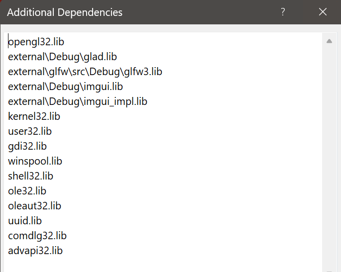

- Path tracing in GLSL shaders
- OpenGL local application
- Imgui to add interactive UI

External packages:
- GLAD
- GLFW
- GLM
- GLSL-Shader-Includes
- Imgui

# main.cpp
## handleInput
## main
- init glfw
- setup window and context
[text](https://learnopengl.com/Getting-started/Creating-a-window)

### OpenGL library on Windows
If you're on Windows the OpenGL library opengl32.lib comes with the Microsoft SDK, which is installed by default when you install Visual Studio. Since this chapter uses the VS compiler and is on windows we add opengl32.lib to the linker settings. 

### glfw
GLFW is a library, written in C, specifically targeted at OpenGL. GLFW gives us the bare necessities required for rendering goodies to the screen. It allows us to create an OpenGL context, define window parameters, and handle user input, which is plenty enough for our purposes.



### GLAD
- initialize glad

### GLM
[text](https://learnopengl.com/Getting-started/Transformations)

- setup imgui context
- set up renderer ```renderer = std::make_unique<Renderer>(1000, 1000);```

### main app loop
    - imgui, ```ImGui::Begin("Renderer");``` ... ```ImGui::End();```
    - ```renderer->render();```
    - ```imgui::Render()```
    - ```glfwSwapBuffers(window);```


# rectangle.h
basically the shader output screen

class that hold data of the geo, and its opengl objects

function to draw

# shader.h
class to hold opengl shader objects

- compile shader
- link shader

functions to set uniforms for shader program

# scene.h

# camera.h
class to hold cam info

functions to set fov, move, and orbit


# renderer.h
this is the opengl renderer, which put a quad onto the screen/ app window

create rectangle object and shader objects

setup accumulate texture

setup rng state texture

setup UBO

pass the values of the uniforms into the shaders

pass the camera info into the shaders

```render``` function to call ```draw``` function on rectangle based on path tracing method option and visualization mode

# GLSL Shaders
This part is very similar to Path Tracing Workshop I've covered.

But the code here are very well refactored and are splitted into multiple files based on their goals. They form a great mind map for the path tracing system I've studied so far.

They are mainly fragment shaders for pixel value calculation. There is only one vertex shader for setting up the rectangle.

## pt.frag

TBC


